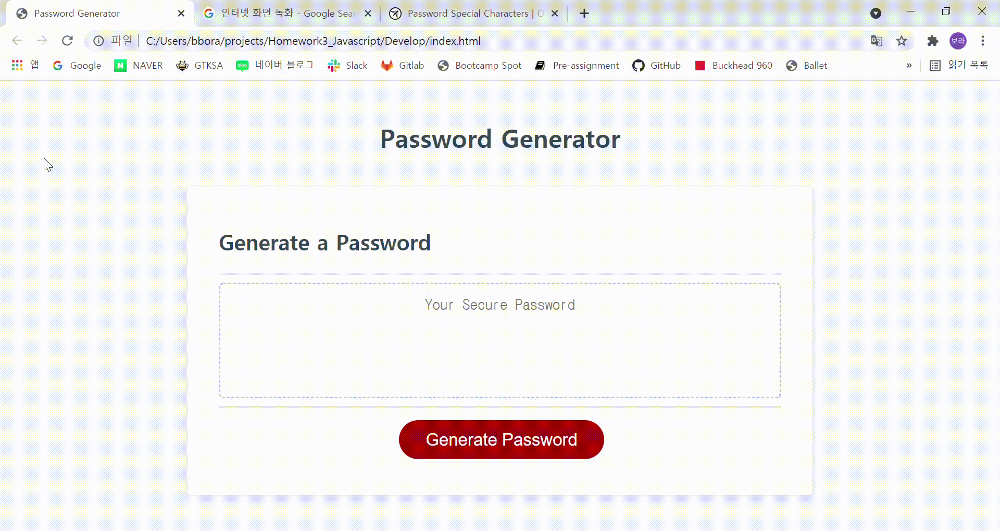

# Homework3_Javascript

<Password Generator>

1. You can generate a confidential password in this web page.

2. Choose length of password you want. The length should be number and the range is between 8 to 128.

3. You have to choose at least one charactor types among lowercases, uppercase, numeric and special characters.

4. After select each types you want, you can see the password generated.

5. The password generator link is below.

https://radoll93.github.io/Homework3_Javascript/

